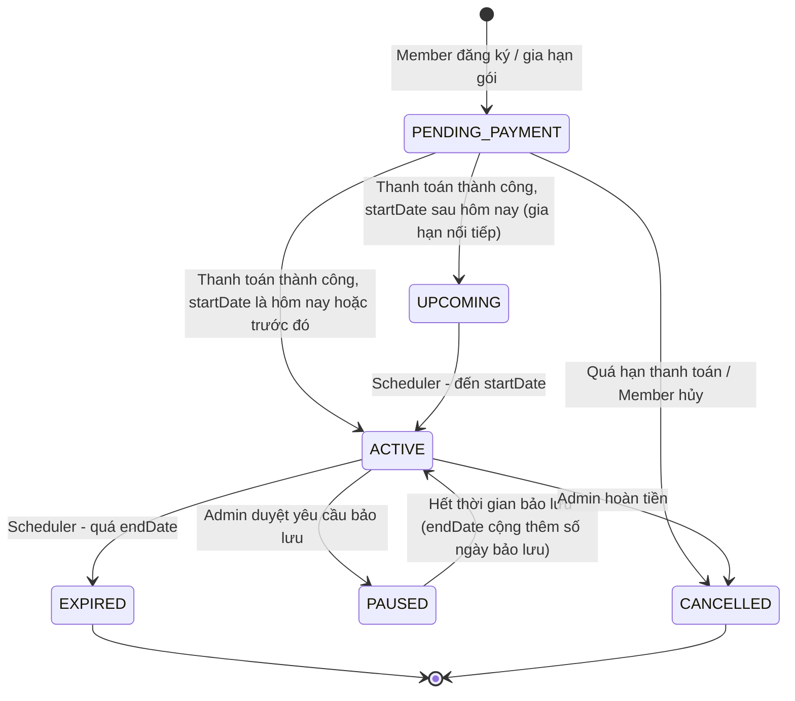
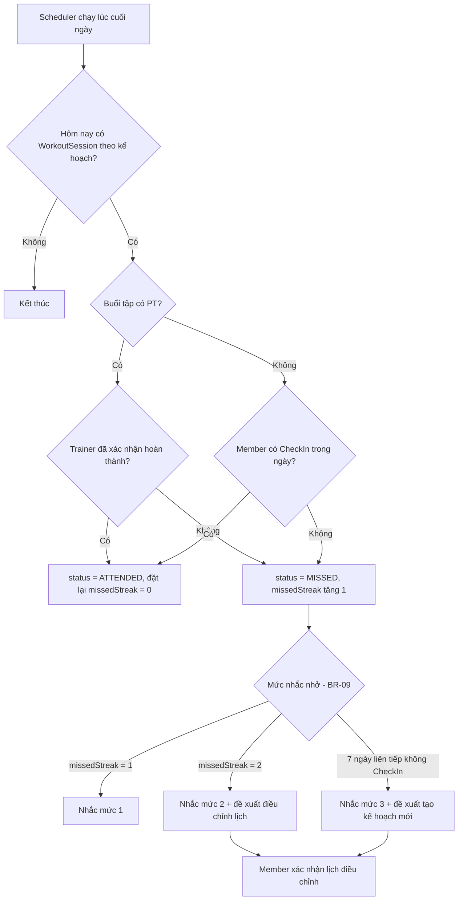

# Đặc tả Yêu cầu Chức năng (Functional Requirements)

**Đề tài:** Xây dựng hệ thống quản lý phòng gym
**Phiên bản:** 1.1 — Bản nháp (đã rà soát)

---

## Lịch sử thay đổi

| Phiên bản | Nội dung thay đổi |
|-----------|-------------------|
| 1.0 | Bản nháp ban đầu. |
| 1.1 | (1) Chuẩn hóa mã yêu cầu, loại bỏ mã trùng/khuyết (CHK, PLAN, CHAT, mục 2.12). (2) Gộp các yêu cầu trùng lặp (BODY-02/BODY-04, CHAT-04 thứ hai). (3) Điều chỉnh MoSCoW theo phạm vi lõi: Face check-in và Chat nâng lên M; PKG-06/ADM-04 thống nhất mức C. (4) Chuyển nguồn dữ liệu InBody sang nhập file CSV; đọc ảnh phiếu hạ xuống C. (5) Tái cấu trúc module PLAN: theo dõi chuyên cần dựa trên dữ liệu `CheckIn`, bỏ thao tác đánh dấu hoàn thành từng bài tập. (6) Cập nhật nền tảng Trainer (Mobile + Web). (7) Bổ sung tác nhân phụ (Payment Gateway, Scheduler), quản lý thiết bị, các yêu cầu còn thiếu. (8) Bổ sung Quy tắc nghiệp vụ, Yêu cầu phi chức năng, Ràng buộc. (9) Loại module BOT khỏi phạm vi, chuyển sang Hướng phát triển. |

---

## 1. Tổng quan

### 1.1. Tác nhân (Actors)

| Mã | Tác nhân | Loại | Nền tảng | Mô tả |
|----|----------|------|----------|-------|
| A1 | Guest (Khách vãng lai) | Chính | Web (Landing page) | Người chưa có tài khoản, tìm hiểu phòng gym |
| A2 | Member (Hội viên) | Chính | Mobile App | Khách hàng đã đăng ký tài khoản |
| A3 | Trainer (Huấn luyện viên – PT) | Chính | Mobile App + Web (Trainer Portal) | Huấn luyện viên cá nhân; dùng Mobile cho chat, lịch hẹn, xác nhận buổi tập; dùng Web để soạn và duyệt kế hoạch |
| A4 | Admin (Chủ phòng gym) | Chính | Web Admin + Kiosk tại quầy | Quản trị toàn bộ hệ thống, kiêm nghiệp vụ tại quầy (check-in thủ công, thu tiền, nhập dữ liệu InBody) |
| A5 | AI Service | Phụ (hệ thống ngoài) | Backend | Gợi ý `WorkoutPlan`, `MealPlan`; điều chỉnh thực đơn theo cân nặng |
| A6 | Payment Gateway | Phụ (hệ thống ngoài) | VNPay / MoMo | Xử lý thanh toán trực tuyến, gửi callback/IPN |
| A7 | Scheduler | Phụ (tác nhân thời gian) | Backend | Chạy tác vụ định kỳ: chuyển trạng thái gói tập, nhắc lịch, phát hiện buổi tập bị bỏ lỡ |

### 1.2. Quy ước

- Mã yêu cầu chức năng: `FR-<Module>-<STT>` (VD: `FR-AUTH-01`). Số thứ tự liên tục, không trùng lặp.
- Quy tắc nghiệp vụ: `BR-<STT>`; Yêu cầu phi chức năng: `NFR-<STT>`; Ràng buộc: `C-<STT>`.
- Độ ưu tiên (MoSCoW): **M** = Must, **S** = Should, **C** = Could.
- Tên thực thể viết theo `PascalCase`, thống nhất giữa tài liệu FR, Use Case, ERD và Class Diagram.

### 1.3. Danh sách Module

| Mã | Module | Tác nhân tham gia |
|----|--------|-------------------|
| AUTH | Xác thực & Tài khoản | Guest, Member, Trainer, Admin |
| LAND | Landing Page | Guest, Admin |
| PKG | Gói tập & Đăng ký hội viên | Member, Admin, Scheduler |
| PAY | Thanh toán | Member, Admin, Payment Gateway |
| CHK | Check-in (Face ID / QR) | Member, Admin |
| BODY | Chỉ số cơ thể (InBody) | Member, Trainer, Admin |
| PLAN | Kế hoạch tập luyện & dinh dưỡng | Member, Trainer, AI Service, Scheduler |
| APPT | Lịch hẹn với PT | Member, Trainer, Scheduler |
| EXE | Thư viện bài tập & Video | Member, Trainer, Admin |
| CHAT | Nhắn tin Member – PT | Member, Trainer, Admin |
| NOTI | Thông báo | Member, Trainer, Admin, Scheduler |
| ADM | Quản trị hệ thống | Admin |
| RPT | Báo cáo & Thống kê | Admin |

### 1.4. Ngoài phạm vi (Hướng phát triển)

- Chatbot hỗ trợ tư vấn (BOT) cho Guest/Member.
- Đọc phiếu InBody bằng ảnh qua AI (giữ ở mức C — `FR-BODY-07`).
- Tách vai trò Lễ tân (Receptionist/Staff) thành tác nhân riêng. Hệ thống phân quyền theo permission để có thể bổ sung vai trò này mà không thay đổi kiến trúc.

---

## 2. Yêu cầu chức năng chi tiết

### 2.1. AUTH – Xác thực & Tài khoản

- **FR-AUTH-01 (M):** Member đăng ký tài khoản bằng email/số điện thoại + mật khẩu, xác thực OTP.
- **FR-AUTH-02 (M):** Người dùng đăng nhập bằng email/SĐT + mật khẩu.
- **FR-AUTH-03 (M):** Hệ thống phân quyền theo vai trò (RBAC): Member, Trainer, Admin; quyền được gán theo permission để mở rộng vai trò về sau.
- **FR-AUTH-04 (M):** Người dùng đăng xuất, làm mới phiên (refresh token).
- **FR-AUTH-05 (M):** Người dùng quên mật khẩu, đặt lại qua OTP/email.
- **FR-AUTH-06 (M):** Người dùng xem và cập nhật hồ sơ cá nhân (ảnh đại diện, thông tin liên hệ).
- **FR-AUTH-07 (M):** Member đăng ký dữ liệu khuôn mặt (Face Enrollment) phục vụ check-in.
- **FR-AUTH-08 (M):** Tài khoản Trainer do Admin tạo, không tự đăng ký.
- **FR-AUTH-09 (M):** Member xác nhận đồng ý xử lý dữ liệu sinh trắc học trước khi đăng ký `FaceData`; có thể xóa hoặc đăng ký lại dữ liệu khuôn mặt.
- **FR-AUTH-10 (S):** Trainer bắt buộc đổi mật khẩu ở lần đăng nhập đầu tiên.

### 2.2. LAND – Landing Page (Web)

- **FR-LAND-01 (M):** Guest xem thông tin giới thiệu phòng gym (cơ sở vật chất, giờ mở cửa, địa chỉ).
- **FR-LAND-02 (M):** Guest xem danh sách gói tập và bảng giá.
- **FR-LAND-03 (M):** Guest xem danh sách và hồ sơ PT (chuyên môn, kinh nghiệm, chứng chỉ).
- **FR-LAND-04 (S):** Guest gửi form đăng ký tư vấn / tập thử (`ConsultationRequest`).
- **FR-LAND-05 (S):** Guest xem liên kết tải ứng dụng mobile.

### 2.3. PKG – Gói tập & Đăng ký hội viên

- **FR-PKG-01 (M):** Member xem danh sách gói tập (`MembershipPackage`): thời hạn, giá, quyền lợi.
- **FR-PKG-02 (M):** Member đăng ký/mua gói tập, hệ thống tạo `Membership` ở trạng thái `PENDING_PAYMENT`.
- **FR-PKG-03 (M):** Member xem gói đang sử dụng, ngày hết hạn, lịch sử đăng ký.
- **FR-PKG-04 (M):** Member gia hạn gói tập (áp dụng BR-01).
- **FR-PKG-05 (S):** Member đăng ký gói tập kèm PT (số buổi PT).
- **FR-PKG-06 (C):** Member yêu cầu bảo lưu (tạm dừng) gói tập (`MembershipFreezeRequest`), chờ Admin duyệt.
- **FR-PKG-07 (M):** Hệ thống tự động chuyển trạng thái `Membership` theo thời gian (kích hoạt, hết hạn) — xem Phụ lục A.
- **FR-PKG-08 (M):** Admin thêm/sửa/ẩn gói tập.
- **FR-PKG-09 (M):** Hệ thống tự hủy `Membership` ở trạng thái `PENDING_PAYMENT` khi quá thời hạn thanh toán (BR-02).
- **FR-PKG-10 (S):** Member chọn PT mong muốn khi đăng ký gói kèm PT; Admin xác nhận phân công (liên kết FR-ADM-03).

### 2.4. PAY – Thanh toán

- **FR-PAY-01 (M):** Member thanh toán trực tuyến qua cổng thanh toán (VNPay/MoMo).
- **FR-PAY-02 (M):** Hệ thống nhận callback/IPN, cập nhật trạng thái `Payment` và kích hoạt `Membership`.
- **FR-PAY-03 (M):** Member xem lịch sử thanh toán và hóa đơn.
- **FR-PAY-04 (M):** Admin ghi nhận thanh toán tại quầy (tiền mặt/chuyển khoản).
- **FR-PAY-05 (M):** Admin tra cứu, lọc danh sách giao dịch.
- **FR-PAY-06 (C):** Admin xử lý hoàn tiền.
- **FR-PAY-07 (S):** Member áp dụng mã khuyến mãi (`Promotion`) khi thanh toán.
- **FR-PAY-08 (M):** Hệ thống xác thực chữ ký callback/IPN và xử lý idempotent (callback lặp không kích hoạt gói nhiều lần).

### 2.5. CHK – Check-in

- **FR-CHK-01 (M):** Member check-in bằng nhận diện khuôn mặt (Face Recognition) tại Kiosk quầy lễ tân.
- **FR-CHK-02 (S):** Member check-in bằng mã QR động trên app (phương án dự phòng khi nhận diện khuôn mặt thất bại).
- **FR-CHK-03 (M):** Hệ thống kiểm tra `Membership` trước khi ghi nhận `CheckIn`; từ chối và hiển thị lý do nếu gói hết hạn, bị tạm dừng hoặc chưa kích hoạt.
- **FR-CHK-04 (M):** Member xem lịch sử check-in (số buổi tập theo tuần/tháng).
- **FR-CHK-05 (M):** Admin xem nhật ký check-in theo thời gian thực.
- **FR-CHK-06 (S):** Admin check-in thủ công khi thiết bị lỗi, bắt buộc ghi lý do.

### 2.6. BODY – Chỉ số cơ thể (InBody)

- **FR-BODY-01 (M):** Admin nhập file CSV xuất từ máy InBody; hệ thống ánh xạ từng bản ghi vào Member tương ứng (theo mã hội viên/SĐT) và lưu thành `BodyMetric`.
- **FR-BODY-02 (M):** Hệ thống kiểm tra dữ liệu import (sai định dạng, trùng bản ghi, không khớp Member) và trả về báo cáo lỗi.
- **FR-BODY-03 (M):** Member tự nhập chỉ số cơ thể thủ công (cân nặng, % mỡ, khối lượng cơ, BMI, BMR, mỡ nội tạng…) khi không có dữ liệu InBody.
- **FR-BODY-04 (M):** Member ghi nhận cân nặng hằng tuần (`WeightLog`) làm đầu vào điều chỉnh thực đơn (FR-PLAN-05).
- **FR-BODY-05 (M):** Member xem lịch sử chỉ số dạng bảng và biểu đồ xu hướng.
- **FR-BODY-06 (M):** Trainer xem `BodyMetric`, `WeightLog` (cân nặng, chiều cao, chỉ số InBody…) của Member mình phụ trách.
- **FR-BODY-07 (C):** Member chụp/tải ảnh phiếu InBody, AI Service trích xuất chỉ số; Member xem lại và chỉnh sửa trước khi lưu.

### 2.7. PLAN – Kế hoạch tập luyện & dinh dưỡng

#### 2.7.1. Hồ sơ đầu vào

- **FR-PLAN-01 (M):** Member khai báo hồ sơ tập luyện (`TrainingProfile`): mục tiêu (giảm mỡ, tăng cơ, duy trì, tập để khỏe khoắn dẻo dai, thi đấu, có thân hình đẹp…), trình độ, số buổi/tuần, các ngày rảnh trong tuần, chấn thương/khuyết tật (vùng cơ thể bị ảnh hưởng), nhóm cơ yếu cần cải thiện, sở thích tập luyện và bài tập yêu thích.
- **FR-PLAN-02 (M):** Member khai báo hồ sơ dinh dưỡng (`NutritionProfile`): ngân sách ăn uống, món ăn yêu thích, dị ứng/kiêng khem; và chọn mức tư vấn **Cơ bản** hoặc **Chi tiết**.

#### 2.7.2. Sinh và duyệt kế hoạch

- **FR-PLAN-03 (M):** AI Service gợi ý `WorkoutPlan` theo tuần dựa trên `TrainingProfile` và `BodyMetric` gần nhất; chỉ sử dụng `Exercise` có `Equipment` đang hoạt động tại phòng gym (BR-11).
- **FR-PLAN-04 (M):** AI Service gợi ý `MealPlan` theo mức tư vấn:
  - *Cơ bản:* khuyến nghị chung — nhóm thực phẩm nên ăn, nên hạn chế.
  - *Chi tiết:* tính calo (TDEE) và macro, lên thực đơn cho từng bữa, từng ngày.
- **FR-PLAN-05 (M):** AI Service điều chỉnh `MealPlan` dựa trên xu hướng `WeightLog` hằng tuần so với mục tiêu.
- **FR-PLAN-06 (M):** Trainer tạo/chỉnh sửa `WorkoutPlan`, `MealPlan` cụ thể cho Member có thuê PT (thực hiện trên Trainer Portal – Web).
- **FR-PLAN-07 (M):** Với Member có PT, kế hoạch do AI gợi ý ở trạng thái `PENDING_REVIEW` và chỉ được áp dụng sau khi Trainer duyệt/điều chỉnh. Với Member không có PT, kế hoạch được áp dụng ngay kèm tuyên bố miễn trừ (NFR-04).

#### 2.7.3. Thực hiện và ghi nhận

- **FR-PLAN-08 (M):** Member xem kế hoạch tập luyện và dinh dưỡng theo ngày/tuần.
- **FR-PLAN-09 (M):** Member ghi nhận mức tạ, số set, số rep thực tế (`WorkoutLog`) cho các bài tập trong kế hoạch để theo dõi sự tăng tiến.
- **FR-PLAN-10 (S):** Hệ thống gợi ý tăng mức tạ khi số rep ghi nhận vượt ngưỡng trên của khoảng rep trong kế hoạch (VD: kế hoạch 8–10 rep, thực tế 11 rep).

#### 2.7.4. Theo dõi chuyên cần và điều chỉnh lịch

- **FR-PLAN-11 (M):** Hệ thống xác định trạng thái từng buổi tập theo lịch (`WorkoutSession`): buổi tự tập căn cứ vào dữ liệu `CheckIn` trong ngày; buổi tập có PT căn cứ vào xác nhận của Trainer. Khi Member bỏ lỡ buổi tập, hệ thống gửi nhắc nhở theo 3 mức (BR-09, FR-NOTI-06).
- **FR-PLAN-12 (M):** Hệ thống ưu tiên duy trì lịch tập cố định theo tuần để thuận tiện theo dõi sự tăng tiến. Khi Member bỏ lỡ buổi tập, hệ thống đề xuất lịch điều chỉnh phù hợp với lịch cũ và khoảng thời gian đã nghỉ; với Member thường xuyên bỏ tập, hệ thống đề xuất lịch mới phù hợp với số buổi tập thực tế (BR-08). Member xác nhận trước khi lịch mới được áp dụng.
- **FR-PLAN-13 (S):** Với Member có PT, Trainer là người xác nhận hoàn thành các buổi tập có PT.
- **FR-PLAN-14 (S):** Member có thể yêu cầu tạo kế hoạch mới nếu thấy không phù hợp; kế hoạch cũ chuyển sang trạng thái `ARCHIVED` và vẫn tra cứu được.

#### 2.7.5. Phía Trainer

- **FR-PLAN-15 (M):** Trainer xem danh sách Member mình phụ trách kèm hồ sơ tập luyện, chỉ số cơ thể, `WorkoutLog`, lịch sử chuyên cần và kế hoạch hiện hành.

### 2.8. APPT – Lịch hẹn với PT

- **FR-APPT-01 (M):** Trainer thiết lập khung giờ rảnh (`TrainerSchedule`).
- **FR-APPT-02 (M):** Member đặt lịch hẹn (`Appointment`) với PT theo khung giờ trống.
- **FR-APPT-03 (M):** Trainer xác nhận/từ chối lịch hẹn.
- **FR-APPT-04 (M):** Member/Trainer hủy hoặc dời lịch trước thời hạn quy định (BR-04).
- **FR-APPT-05 (M):** Hệ thống trừ số buổi PT còn lại (`PTSessionBalance`) khi buổi tập hoàn thành, hoặc khi Member vắng mặt/hủy muộn (BR-04).
- **FR-APPT-06 (M):** Member/Trainer xem lịch hẹn dạng lịch (calendar).
- **FR-APPT-07 (M):** Member chỉ đặt được lịch hẹn khi còn số buổi PT.
- **FR-APPT-08 (S):** Trainer ghi nhận Member vắng mặt (no-show).

### 2.9. EXE – Thư viện bài tập & Video

- **FR-EXE-01 (M):** Member tra cứu bài tập (`Exercise`) theo nhóm cơ, mục đích (kháng lực, cardio, hybrid, phục hồi…), dụng cụ (`Equipment`), độ khó.
- **FR-EXE-02 (M):** Member xem video hướng dẫn và mô tả kỹ thuật bài tập.
- **FR-EXE-03 (M):** Admin/Trainer thêm/sửa/xóa bài tập và video.
- **FR-EXE-04 (C):** Member lưu bài tập yêu thích (`FavoriteExercise`).
- **FR-EXE-05 (M):** Mỗi `Exercise` được gắn với danh sách `Equipment` cần sử dụng.

### 2.10. CHAT – Nhắn tin Member – PT

- **FR-CHAT-01 (M):** Member nhắn tin 1–1 thời gian thực với PT phụ trách; chỉ khả dụng khi Member có `TrainerAssignment` còn hiệu lực.
- **FR-CHAT-02 (M):** Người dùng gửi văn bản và hình ảnh.
- **FR-CHAT-03 (M):** Người dùng xem lịch sử hội thoại, trạng thái đã đọc.
- **FR-CHAT-04 (C):** Người dùng báo cáo tin nhắn vi phạm (`MessageReport`); Admin xem xét và xử lý.

### 2.11. NOTI – Thông báo

- **FR-NOTI-01 (M):** Hệ thống gửi push notification nhắc gói tập sắp hết hạn.
- **FR-NOTI-02 (M):** Hệ thống nhắc lịch hẹn PT sắp diễn ra.
- **FR-NOTI-03 (S):** Hệ thống thông báo khi có tin nhắn mới, kế hoạch mới được cập nhật.
- **FR-NOTI-04 (S):** Admin gửi thông báo chung (khuyến mãi, lịch nghỉ lễ) tới Member.
- **FR-NOTI-05 (M):** Người dùng xem danh sách thông báo trong app.
- **FR-NOTI-06 (M):** Hệ thống gửi thông báo nhắc nhở khi Member bỏ lỡ buổi tập theo 3 mức (FR-PLAN-11, BR-09).
- **FR-NOTI-07 (S):** Hệ thống thông báo cho Trainer khi có kế hoạch chờ duyệt, lịch hẹn mới hoặc lịch hẹn bị hủy/dời.

### 2.12. ADM – Quản trị hệ thống (Web Admin)

- **FR-ADM-01 (M):** Admin quản lý Member: xem, tìm kiếm, khóa/mở khóa, xem gói tập và lịch sử.
- **FR-ADM-02 (M):** Admin quản lý Trainer: tạo tài khoản, cập nhật hồ sơ, khóa tài khoản.
- **FR-ADM-03 (M):** Admin phân công Trainer cho Member (`TrainerAssignment`).
- **FR-ADM-04 (C):** Admin duyệt yêu cầu bảo lưu gói tập.
- **FR-ADM-05 (S):** Admin quản lý nội dung landing page (banner, giới thiệu).
- **FR-ADM-06 (S):** Admin quản lý mã giảm giá / khuyến mãi (`Promotion`).
- **FR-ADM-07 (C):** Admin xem nhật ký thao tác hệ thống (`AuditLog`).
- **FR-ADM-08 (M):** Admin quản lý thiết bị phòng gym (`Equipment`): thêm/sửa, cập nhật trạng thái hoạt động/bảo trì.
- **FR-ADM-09 (S):** Admin xem và xử lý yêu cầu tư vấn/tập thử (`ConsultationRequest`) gửi từ Landing Page.
- **FR-ADM-10 (S):** Admin cấu hình tham số hệ thống (`SystemSetting`): giờ mở cửa, thời hạn thanh toán, thời hạn hủy lịch hẹn, số ngày nhắc hết hạn gói, ngưỡng chuyên cần.

### 2.13. RPT – Báo cáo & Thống kê

- **FR-RPT-01 (M):** Admin xem doanh thu theo ngày/tháng/năm, theo gói tập.
- **FR-RPT-02 (M):** Admin xem số lượng hội viên mới, đang hoạt động, hết hạn.
- **FR-RPT-03 (S):** Admin xem lưu lượng check-in theo khung giờ (giờ cao điểm).
- **FR-RPT-04 (S):** Admin xem thống kê hiệu suất Trainer (số buổi, số Member).
- **FR-RPT-05 (C):** Admin xuất báo cáo ra Excel/PDF.

---

## 3. Quy tắc nghiệp vụ (Business Rules)

| Mã | Quy tắc | Liên quan |
|----|---------|-----------|
| BR-01 | Gia hạn khi gói còn hiệu lực tạo `Membership` mới có `startDate` nối tiếp `endDate` của gói hiện tại (trạng thái `UPCOMING`). | FR-PKG-04 |
| BR-02 | `Membership` ở trạng thái `PENDING_PAYMENT` tự hủy sau thời hạn thanh toán cấu hình trong `SystemSetting`. | FR-PKG-09 |
| BR-03 | Tổng thời gian bảo lưu không vượt quá mức tối đa quy định cho từng `MembershipPackage`; `endDate` được cộng thêm số ngày bảo lưu. | FR-PKG-06, FR-ADM-04 |
| BR-04 | Hủy/dời lịch hẹn PT phải thực hiện trước giờ hẹn tối thiểu N giờ (cấu hình). Hủy muộn hoặc vắng mặt vẫn bị trừ buổi PT. | FR-APPT-04, FR-APPT-05 |
| BR-05 | Mỗi Member có tối đa một `WorkoutPlan` và một `MealPlan` ở trạng thái `ACTIVE` tại một thời điểm. | FR-PLAN-07, FR-PLAN-14 |
| BR-06 | Mỗi Member chỉ có một Trainer phụ trách tại một thời điểm. | FR-ADM-03, FR-CHAT-01 |
| BR-07 | Không ghi nhận hai `CheckIn` của cùng một Member trong khoảng thời gian cấu hình (chống quét lặp). | FR-CHK-01, FR-CHK-02 |
| BR-08 | Nếu tỉ lệ chuyên cần (số buổi `ATTENDED` / số buổi theo kế hoạch) trong 2 tuần gần nhất thấp hơn ngưỡng cấu hình, hệ thống đề xuất lịch mới phù hợp với số buổi tập thực tế; ngược lại giữ nguyên lịch cố định. | FR-PLAN-12 |
| BR-09 | Mức nhắc nhở bỏ buổi: **Mức 1** — bỏ lỡ 1 buổi; **Mức 2** — bỏ lỡ 2 buổi liên tiếp, kèm đề xuất điều chỉnh lịch; **Mức 3** — 7 ngày liên tiếp không có `CheckIn`, kèm đề xuất tạo kế hoạch mới. Bộ đếm được đặt lại khi Member tham gia buổi tập tiếp theo. | FR-PLAN-11, FR-NOTI-06 |
| BR-10 | Một buổi tập có PT được tính hoàn thành khi Trainer xác nhận; buổi tự tập được tính hoàn thành khi có `CheckIn` trong ngày. | FR-PLAN-11, FR-PLAN-13 |
| BR-11 | Chỉ `Exercise` có toàn bộ `Equipment` ở trạng thái hoạt động mới được đưa vào kế hoạch tập. | FR-PLAN-03, FR-ADM-08 |

---

## 4. Yêu cầu phi chức năng (Non-functional Requirements)

| Mã | Nhóm | Nội dung |
|----|------|----------|
| NFR-01 | Hiệu năng | Thời gian nhận diện khuôn mặt và phản hồi kết quả check-in không quá 2 giây. |
| NFR-02 | Bảo mật | Mật khẩu được băm (bcrypt); xác thực bằng JWT (access token/refresh token); toàn bộ giao tiếp qua HTTPS. |
| NFR-03 | Quyền riêng tư | Chỉ lưu vector đặc trưng khuôn mặt (face embedding), không lưu ảnh gốc; dữ liệu bị xóa khi Member rút lại sự đồng ý. |
| NFR-04 | An toàn nội dung | Mọi kế hoạch do AI tạo hiển thị tuyên bố miễn trừ: nội dung mang tính tham khảo, không thay thế tư vấn y tế/dinh dưỡng chuyên môn. |
| NFR-05 | Truy vết | Các thao tác nhạy cảm của Admin (check-in thủ công, hoàn tiền, khóa tài khoản) được ghi `AuditLog`. |
| NFR-06 | Tương thích | Mobile App hỗ trợ Android và iOS; Web hỗ trợ các trình duyệt Chrome, Edge, Safari phiên bản mới. |

---

## 5. Ràng buộc (Constraints)

- **C-01:** Kiosk check-in sử dụng một webcam gắn ngoài, kết nối với máy tính đặt tại quầy lễ tân.
- **C-02:** Dữ liệu InBody được lấy từ file CSV do máy InBody xuất ra trên máy tính tại phòng gym.
- **C-03:** Thanh toán trực tuyến tích hợp qua cổng VNPay/MoMo (môi trường sandbox trong phạm vi đồ án).

---

## 6. Ma trận Tác nhân – Module

| Module | Guest | Member | Trainer | Admin | AI Service | Payment Gateway | Scheduler |
|--------|:-----:|:------:|:-------:|:-----:|:----------:|:---------------:|:---------:|
| AUTH | ✓ | ✓ | ✓ | ✓ | | | |
| LAND | ✓ | | | ✓ | | | |
| PKG | | ✓ | | ✓ | | | ✓ |
| PAY | | ✓ | | ✓ | | ✓ | |
| CHK | | ✓ | | ✓ | | | |
| BODY | | ✓ | ✓ | ✓ | ✓ *(C)* | | |
| PLAN | | ✓ | ✓ | | ✓ | | ✓ |
| APPT | | ✓ | ✓ | | | | ✓ |
| EXE | | ✓ | ✓ | ✓ | | | |
| CHAT | | ✓ | ✓ | ✓ | | | |
| NOTI | | ✓ | ✓ | ✓ | | | ✓ |
| ADM | | | | ✓ | | | |
| RPT | | | | ✓ | | | |

---

## 7. Thực thể nghiệp vụ chính (tham chiếu cho ERD / Class Diagram)

**Người dùng & phân quyền:** `User`, `Member`, `Trainer`, `Admin`, `FaceData`, `TrainerAssignment`.

**Gói tập & thanh toán:** `MembershipPackage`, `Membership`, `MembershipFreezeRequest`, `PTSessionBalance`, `Payment`, `Promotion`.

**Check-in:** `CheckIn`.

**Chỉ số cơ thể:** `BodyMetric` (thuộc tính `source`: `INBODY_CSV` / `MANUAL` / `OCR`), `WeightLog`.

**Kế hoạch:** `TrainingProfile`, `NutritionProfile`, `WorkoutPlan`, `MealPlan`, `WorkoutSession`, `WorkoutLog`.
- `WorkoutPlan`, `MealPlan` có thuộc tính `status` (`DRAFT` / `PENDING_REVIEW` / `ACTIVE` / `ARCHIVED`) và `createdBy` (`AI` / `TRAINER` / `MEMBER`).
- `WorkoutSession` có thuộc tính `status` (`PLANNED` / `ATTENDED` / `MISSED` / `RESCHEDULED`).

**Bài tập & thiết bị:** `Exercise`, `Equipment`, `FavoriteExercise`.

**Lịch hẹn:** `TrainerSchedule`, `Appointment`.

**Giao tiếp:** `Conversation`, `Message`, `MessageReport`, `Notification`.

**Quản trị:** `ConsultationRequest`, `SystemSetting`, `AuditLog`.

---

## 8. Vấn đề cần chốt

| # | Vấn đề | Hướng xử lý | Trạng thái |
|---|--------|-------------|------------|
| 1 | Module CHAT thuộc phạm vi chính hay mở rộng? | Phạm vi chính (M). | Đã chốt |
| 2 | Có tách vai trò Lễ tân khỏi Admin? | Không tách; Admin kiêm nghiệp vụ quầy. RBAC theo permission để mở rộng vai trò `STAFF` về sau. | Đề xuất – chờ xác nhận |
| 3 | Face Recognition chạy tại thiết bị quầy (edge) hay server? | Server-side: Kiosk (web) tại quầy lấy khung hình từ webcam, gửi về Face Service ở backend để so khớp; chỉ lưu face embedding. | Đề xuất – chờ xác nhận |
| 4 | Kế hoạch AI có bắt buộc PT duyệt? | Bắt buộc với Member có PT; Member không có PT áp dụng ngay kèm tuyên bố miễn trừ (FR-PLAN-07). | Đề xuất – chờ xác nhận |
| 5 | Theo dõi buổi tập bằng cách nào? | Dựa trên `CheckIn` (buổi tự tập) và xác nhận của Trainer (buổi có PT); không yêu cầu Member đánh dấu hoàn thành từng bài tập (FR-PLAN-11, BR-10). | Đề xuất – chờ xác nhận |

---

## Phụ lục A. Máy trạng thái `Membership`

Điều kiện check-in (FR-CHK-03): Member có ít nhất một `Membership` ở trạng thái `ACTIVE`.

## Phụ lục B. Luồng phát hiện buổi tập bị bỏ lỡ

## Phụ lục C. Bảng ánh xạ mã yêu cầu (v1.0 → v1.1)

| Mã v1.0 | Mã v1.1 | Ghi chú |
|---------|---------|---------|
| FR-AUTH-07 (S) | FR-AUTH-07 (M) | Nâng ưu tiên theo phạm vi lõi |
| FR-CHK-03 (Face Recognition) | FR-CHK-01 (M) | Nâng ưu tiên |
| FR-CHK-03 (webcam) | C-01 | Chuyển sang Ràng buộc |
| FR-CHK-04 → 07 | FR-CHK-03 → 06 | Đánh số lại |
| FR-BODY-01 (chụp ảnh phiếu) | FR-BODY-07 (C) | Thay bằng nhập CSV (FR-BODY-01) |
| FR-BODY-02, FR-BODY-04 | FR-BODY-03 | Gộp yêu cầu trùng |
| FR-BODY-03 (xem lại kết quả trích xuất) | FR-BODY-07 | Gộp vào luồng đọc ảnh |
| FR-PLAN-01 (mục tiêu tập) | FR-PLAN-01 | |
| FR-PLAN-01 (chế độ ăn) | FR-PLAN-02, FR-PLAN-04 | Tách hồ sơ đầu vào và mức tư vấn |
| FR-PLAN-02 | FR-PLAN-03 | |
| FR-PLAN-04 | FR-PLAN-04 | |
| FR-PLAN-05 (Trainer tạo kế hoạch) | FR-PLAN-06 | |
| FR-PLAN-05 (Trainer duyệt AI) | FR-PLAN-07 (M) | Làm rõ quy tắc duyệt |
| FR-PLAN-06 (xem kế hoạch, đánh dấu hoàn thành) | FR-PLAN-08 | Bỏ đánh dấu hoàn thành từng bài; chuyên cần xác định qua `CheckIn` |
| FR-PLAN-06 (cân nặng hằng tuần) | FR-BODY-04, FR-PLAN-05 | |
| FR-PLAN-06 (tạ/rep/set) | FR-PLAN-09, FR-PLAN-10 | |
| FR-PLAN-03 (thông báo nghỉ tập) | FR-PLAN-11, FR-NOTI-06, BR-09 | Định nghĩa rõ các mức nhắc |
| FR-PLAN-03 (lên lại lịch) | FR-PLAN-12 | |
| FR-PLAN-03 (duy trì lịch / Member hay bỏ tập) | FR-PLAN-12, BR-08 | |
| FR-PLAN-07 (Trainer xác nhận buổi tập) | FR-PLAN-13 | |
| FR-PLAN-07 (Member tạo lịch mới) | FR-PLAN-14 | |
| Mục 2.12 (Trainer lên lịch trên Web) | FR-PLAN-06 | Gộp; cập nhật nền tảng Trainer |
| FR-CHAT-01 → 03 (S) | FR-CHAT-01 → 03 (M) | Nâng ưu tiên theo phạm vi lõi |
| FR-CHAT-04 (PT xem chỉ số Member) | FR-BODY-06, FR-PLAN-15 | Chuyển đúng module |
| FR-ADM-04 (S) | FR-ADM-04 (C) | Thống nhất với FR-PKG-06 |
| Module BOT (ma trận) | — | Chuyển sang Ngoài phạm vi (mục 1.4) |
